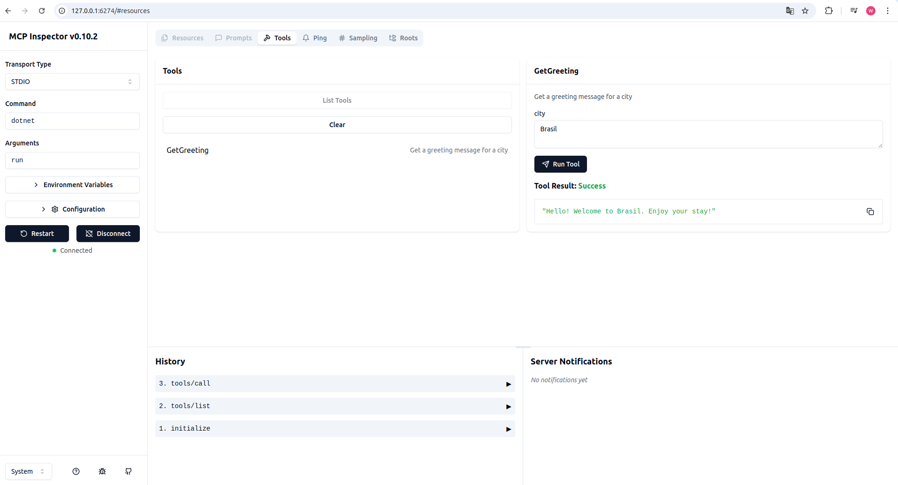

# MCP Hello World

Este projeto demonstra o uso do Model Context Protocol (MCP) com uma aplicação .NET.

## 🚀 Executar o Projeto

1. Navegue até a pasta do projeto:

```bash
cd mcp.helloworld
npx @modelcontextprotocol/inspector dotnet run
```

## 🖼️ Captura de Tela


